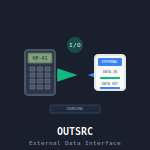

# hp-41_outsrc

 

## HP-41: Break-even analysis for outsourcing

This program analyzes gain/loss, break-even and risk associated with outsourcing of IT development or operations. The program can be used for analysis of development and maintenance of any type of complex solutions.

The background for this program is covered in this article: [Risk in outsourcing IT – A mathematical foundation for break-even and risk analysis of using outsourcing in IT](https://dl.dropboxusercontent.com/u/73825672/outsourcing.pdf).

Here is the key mapping (what shows in the program’s menu is in parenthesis):

Label (Menu)	|Description
----------------|-----------
OUTSRC	|XEQ "OUTSRC" starts the program and shows the mapping for the top keys so that you don’t have to remember this list. Pressing R/S will show the mapping for the shifted top keys. Pressing R/S again gets you back to the unshifted key mappings etc. Before any calculation in the program, you are asked to enter the mentors productivity drop ("D"), the time it takes to achieve proficiency in the area ("T") and, if relevant, the time you want to calculate until ("t") (represented in the program as the up-arrow "↑"). The stored value for each of these variables are shown, and pressing R/S will commence calculation with the stored value.
LBL A (∑c)	|Shows the accumulated productivity of the consultant from the beginning until the time "t". In the referenced article, this is the integral of p(t) from 0 to "t".
LBL a (Pc)	|Shows the productivity of the consultant at time "t". This is p(t) in the article.
LBL B (∑e)	|Shows the accumulated loss in productivity of the employee/mentor from the beginning until the time "t". In the referenced article, this is the integral of Q(t) from 0 to "t".
LBL b (Pe)	|Shows the productivity of the employee/mentor at time "t". This is P(t) in the article.
LBL C (G↑)	|Shows the accumulated gain/loss until time "t", i.e. the productivity of the consultant minus the productivity loss of the employee/mentor.
LBL D (↑)	|Finds the break-even point, i.e. when the accumulated productivity loss of the employee/mentor is made up for by the accumulated productivity of the consultant.
LBL E (\*)	|Go back to the menu.

## License
This software is released into the Public Domain.
